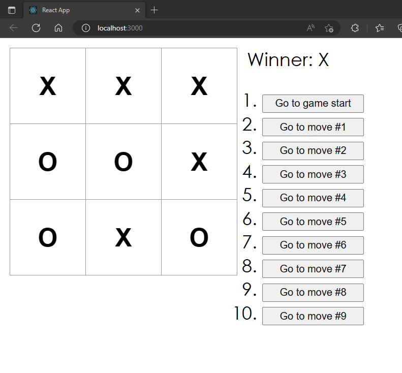

# TicTacToe-React-Hooks

🌟🌟🌟

🚩使用最新的React-Hooks 函数组件来重新实现官方教程的井字棋类组件实现示例

🚩然后把字体、棋盘设置的更大 官方的多少有点小了🤣

### Preview

------



------

❗遇到的坑

🛸原本Game类组件中的代码这部分

```jsx
handleClick(i) {
...................
...................
...................
    this.setState({
      history: history.concat([{squares: squares}]),
      stepNumber: history.length,
      xIsNext: !this.state.xIsNext
    });
  }
```

❌错误修改：

```jsx
const handleClick=(i)=>{
    const historyCurrent = history.slice(0,stepNumber + 1);
...................
...................
...................
    setHistory(historyCurrent.concat([{squares: squaresCurrent}]))
    setStepNumber(history.length)
    setXIsNext(!xIsNext);
  }
```

❗这样会报错

在修改成hooks要注意：

React的setState是批量更新！而不是在set后立马刷新！因此上述的第二句history还是原本的history

✅正确修改：

```jsx
    setHistory(historyCurrent.concat([{squares: squaresCurrent}]))
    setStepNumber(historyCurrent.length)
    setXIsNext(!xIsNext);
```

批量更新是指 React 将多次 state 更新进行合并处理，最终只进行一次渲染，以获得更好的性能。

